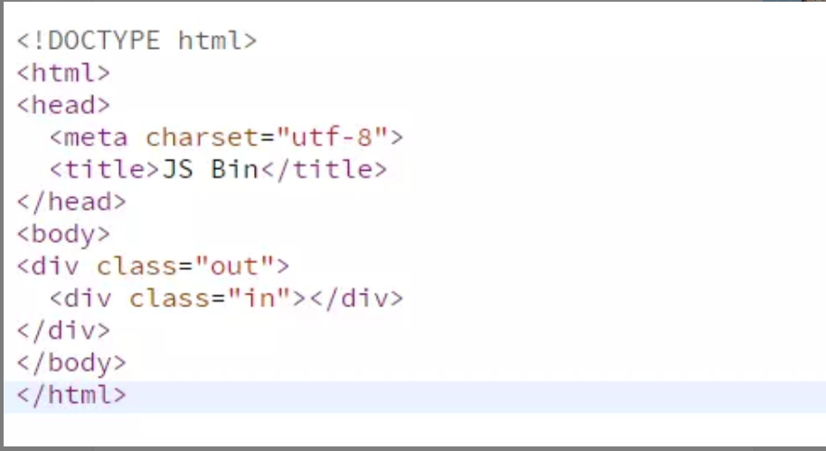
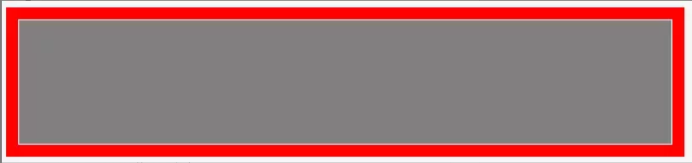
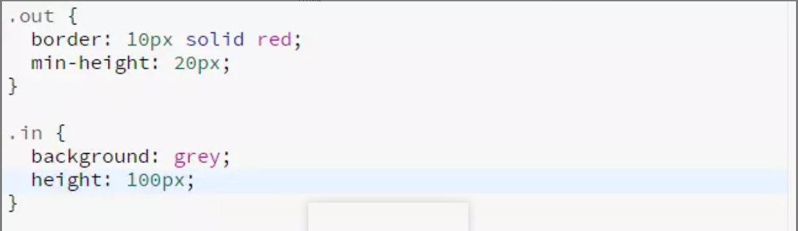
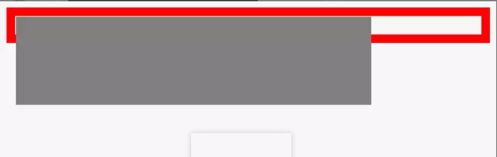
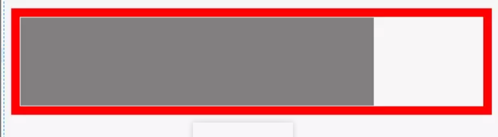
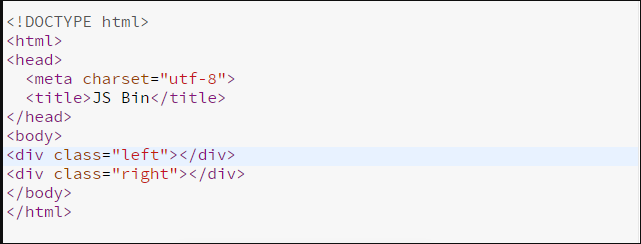
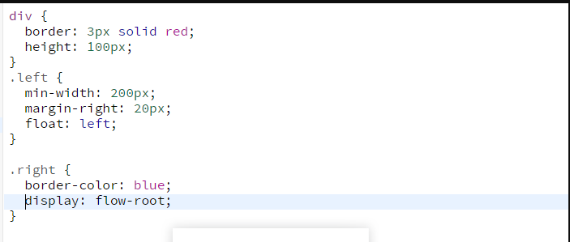
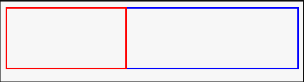
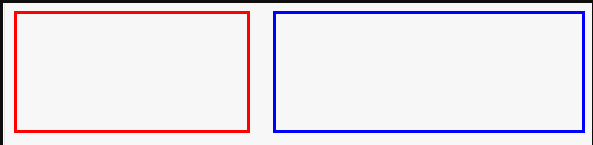

>注： [原文链接:什么是BFC？](https://www.jianshu.com/p/0d713b32cd0d)

## 什么是BFC？
**BFC** 全称为 块格式化上下文 (Block Formatting Context) 。

### 官方的解释。

#### MDN：

> 一个块格式化上下文（block formatting context） 是Web页面的可视化CSS渲染出的一部分。它是块级盒布局出现的区域，也是浮动层元素进行交互的区域。  
一个块格式化上下文由以下之一创建：  
>* 根元素或其它包含它的元素
>* 浮动元素 (元素的 float 不是 none)
>* 绝对定位元素 (元素具有 position 为 absolute 或 fixed)
>* 内联块 (元素具有 display: inline-block)
>* 表格单元格 (元素具有 display: table-cell，HTML表格单元格默认属性)
>* 表格标题 (元素具有 display: table-caption, HTML表格标题默认属性)
>* 具有overflow 且值不是 visible 的块元素，
>* display: flow-root
>* column-span: all 应当总是会创建一个新的格式化上下文，即便具有 column-span: all 的元素并不被包裹在一个多列容器中。
>* 一个块格式化上下文包括创建它的元素内部所有内容，除了被包含于创建新的块级格式化上下文的后代元素内的元素。  
> 
>块格式化上下文对于定位 (参见 float) 与清除浮动 (参见 clear) 很重要。定位和清除浮动的样式规则只适用于处于同一块格式化上下文内的元素。浮动不会影响其它块格式化上下文中元素的布局，并且清除浮动只能清除同一块格式化上下文中在它前面的元素的浮动。

理解BFC倾向于：BFC只有特性(功能)，没有定义。
         
> I know it when i see it.

### BFC 特性(功能)
1. 使 BFC 内部浮动元素不会到处乱跑；
2. 和浮动元素产生边界。
#### 使 BFC 内部的浮动元素不会到处乱跑






在正常的文档流中，块级元素是按照从上自下，内联元素从左到右的顺序排列的。

如果我给里面的元素一个 float 或者绝对定位，它就会脱离普通文档流中。



此时如果我们还想让外层元素包裹住内层元素该如果去做？？

让外层元素产生一个 BFC 。(产生 BFC 的方法 MDN 文档里有写)



这就是 BFC 的第一个作用：**使 BFC 内部的浮动元素不会到处乱跑**。

#### 和浮动元素产生边界




一般情况下如果没有 **BFC**的话，我们想要让普通元素与浮动元素产生左右边距，需要将 ```margin``` 设置为浮动元素的宽度加上你想要产生边距的宽度。

这里的浮动元素的宽度为 ```200px``` ，如果想和它产生 ```20px``` 的右边距，需要将非浮动元素的 ```margin-left``` 设置为 ```200px+20px``` 。

