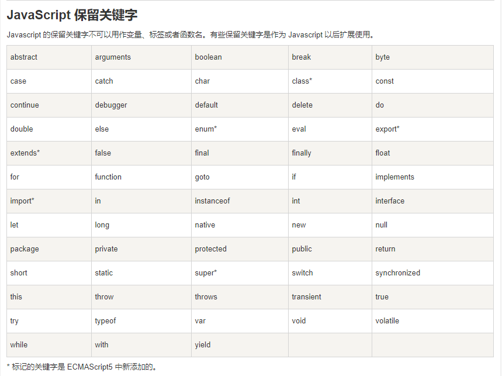

### 1. 数组
js数组的方法中，哪些方法不能改变自身数组？（）
```javascript
pop
splice
sort
concat
```

```javascript
var datas=[10,20,30];
datas.unshift(40,50);
data.pop();
datas.push(60,70);
data.shift();
console.log(datas.toString());
```
执行的后果是？（）

* concat() &nbsp;&nbsp; 连接两个或更多的数组，并返回结果。
* join() &nbsp;&nbsp;&nbsp;&nbsp;&nbsp;&nbsp;&nbsp; 把数组的所有元素放入一个字符串。元素通过指定的分隔符进行分隔。
* pop() &nbsp;&nbsp;&nbsp;&nbsp;&nbsp;&nbsp;&nbsp; 删除并返回数组的最后一个元素
* push() &nbsp;&nbsp;&nbsp;&nbsp;&nbsp; 向数组的末尾添加一个或更多元素，并返回新的长度。
* reverse() &nbsp; 颠倒数组中元素的顺序。
* shift() &nbsp;&nbsp;&nbsp;&nbsp;&nbsp;&nbsp; 删除并返回数组的第一个元素
* slice() &nbsp;&nbsp;&nbsp;&nbsp;&nbsp; 从某个已有的数组返回选定的元素
* sort() &nbsp;&nbsp;&nbsp;&nbsp;&nbsp;&nbsp; 对数组的元素进行排序
* splice() &nbsp;&nbsp;&nbsp; 删除元素，并向数组添加新元素。
* unshift() &nbsp;&nbsp; 头添加一个或更多元素，并返回新的长度。

**结果：```concat、 50,10,20,60,70``**

### 2. XMLHttpRequest
在准备```XMLHttpRequest```对象时，在```send()```前需要调用哪个方法？
```javascript
prepare ()
open ()
init ()
build ()
```

```Ajax```技术核心就是```XMLHttpRequest```对象。
```Ajax```技术的工作原理：可以分成3步
1.创建```Ajax```对象：
```
var xhr = new XMLHttpRequest();
```

2.```xhr```发送请求：
```javascript
xhr.open('get','test.html','true');
xhr.send();
```
3.```xhr```获取响应：
```javascript
xhr.onreadystatechange = function(){
   if(xhr.readystate == 4){//请求的状态码
       /*
           0:请求还没有建立（open执行前）
           1：请求建立了还没发送（执行了open）
           2：请求正式发送（执行了send）
           3：请求已受理，有部分数据可以用，但还没有处理完成
           4：请求完全处理完成
       */
       alert(xhr.responseText);//返回的数据
     }
 }
```

### 3. 
在标准的 JavaScript 中， Ajax 异步执行调用基于下面哪一个机制才能实现？
```javascript
Event和callback
多线程操作
多CPU核
Deferral和promise
```

**参考解析：**
[JavaScript Promise 启示录](http://www.alloyteam.com/2014/05/javascript-promise-mode/)

>```JavaScript```是**单线程**的，**浏览器**实现了**异步**的操作，整个js程序是**事件驱动**的，每个事件都会绑定相应的**回调函数**

**答案：```Event和callback```**

### 4. javascript保留关键字
下面哪一个不是 JavaScript 的保留字？
```javascript
goto
abstract
implements
super
array
```




**答案: ```array```**

### 5. 数组 + 1
以下哪些方法会返回一个数组？
```javascript
Array.from(A)
[].slice.apply(A)
[…A]
[].map.call(A, o => o)

Object.keys()
String.prototype.split()
Array.prototype.join()
Promise.all()
```

1. ```Array.from(arr, mapfn,thisArg)```方法，用于将两类可以把对象转换为真正的数组：  
类似数组的对象和可遍历的对象（部署了Iterator接口的，String，ES6新增的Map和Set）。  
可以传3个参数，
    - 其中第一个是数组，必传；
    - 第二个是一个函数（类似map函数），对数组元素进行操作后再返回数组，可选；
    - 第三个是对于this关键字的指向，可选。
2. ```slice()``` 方法可从已有的数组中返回选定的元素。  
返回值：返回一个新的数组，包含从 start 到 end （不包括该元素）的 arrayObject 中的元素。  
说明: 
    - 请注意，该方法并不会修改数组，而是返回一个子数组。
    - 如果想删除数组中的一段元素，应该使用方法 Array.splice()。  
    
    所以在这里就是对集合A应用slice，返回一个新的数组，不对数组做任何改变。
3. 展开运算符，把A集合的元素展开后，用数组[]承载，返回新的数组。  
    [ES6 展开语法](https://developer.mozilla.org/zh-CN/docs/Web/JavaScript/Reference/Operators/Spread_syntax)  
    [ES6 展开运算符](https://mingjiezhang.github.io/2016/09/24/ECMAScript-6%E5%AD%A6%E4%B9%A0%E7%AC%94%E8%AE%B0%EF%BC%88%E4%B8%80%EF%BC%89%EF%BC%9A%E5%B1%95%E5%BC%80%E8%BF%90%E7%AE%97%E7%AC%A6/)
4. ```map()``` 方法返回一个新数组，数组中的元素为原始数组元素调用函数处理后的值。  
map() 方法按照原始数组元素顺序依次处理元素。  
注意： map() 不会对空数组进行检测。  
注意： map() 不会改变原始数组。  
所以map方法返回了一个新的数组，并且数组中每个元素是A里面的元素。
1. ```Object.keys()```
该方法会返回一个由一个给定对象的自身可枚举属性组成的数组，数组中属性名的排列顺序和使用 for...in 循环遍历该对象时返回的顺序一致 。如果对象的键-值都不可枚举，那么将返回由键组成的数组。

1. ```String.prototype.split()```  
```split()``` 方法使用指定的分隔符字符串将一个String对象分割成字符串数组，以将字符串分隔为子字符串，以确定每个拆分的位置。

1. ```Array.prototype.join()```  
```join()``` 方法将一个数组（或一个类数组对象）的所有元素连接成一个字符串并返回这个字符串。如果数组只有一个项目，那么将返回该项目而不使用分隔符。

1. ```Promise.all()```  
```Promise.all(iterable)``` 方法返回一个 ```Promise``` 实例，此实例在 ```iterable``` 参数内所有的 ```promise``` 都“完成```（resolved）```”或参数中不包含 ```promise``` 时回调完成```（resolve）```；  
如果参数中 ```promise``` 有一个失败```（rejected）```，此实例回调失败```（reject）```，失败原因的是第一个失败 ```promise``` 的结果。  
[Promise.all](https://developer.mozilla.org/zh-CN/docs/Web/JavaScript/Reference/Global_Objects/Promise/all)  
[ES6 Promise对象Promise.all()方法的使用](https://itbilu.com/javascript/js/41KMSZ9a.html)

**答案: 除了```join()``` 和 ```Promise.all```之外都是**